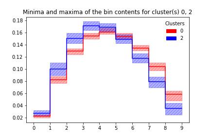
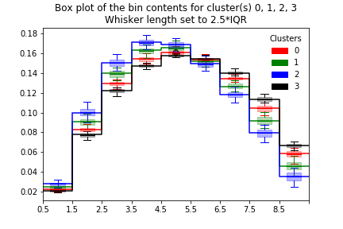

Clustering of B to D tau nu kinematical shapes
==============================================

|Build Status| |Doc Status|

.. |Build Status| image:: https://travis-ci.org/RD-clustering/B_decays_clustering.svg?branch=master
   :target: https://travis-ci.org/RD-clustering/B_decays_clustering

.. |Doc Status| image:: https://readthedocs.org/projects/clusterking/badge/?version=latest
   :target: https://clusterking.readthedocs.io/en/latest/
   :alt: Documentation Status

.. start-body

Description
-----------

This package provides a flexible yet easy to use framework to cluster sets of histograms (or other higher dimensional data) and to select benchmark points representing each cluster. The package particularly focuses on use cases in high energy physics.

Physics Case
------------

While most of this package is very general can be applied to a broad variety of use cases, we have been focusing on applications in high energy physics (particle physics) so far and provide additional convenience methods for this use case. In particular, most of the current tutorials are in this context.

Though very successful, the Standard Model of Particle Physics is believed to be uncomplete, prompting the search for New Physics (NP).
The phenomenology of NP models typically depends on a number of free parameters, sometimes strongly influencing the shape of distributions of kinematic variables. Besides being an obvious challenge when presenting exclusion limits on such models, this also is an issue for experimental analyses that need to make assumptions on kinematic distributions in order to extract features of interest, but still want to publish their results in a very general way.

By clustering the NP parameter space based on a metric that quantifies the similarity of the resulting kinematic distributions, a small number of NP benchmark points can be chosen in such a way that they can together represent the whole parameter space. Experiments (and theorists) can then report exclusion limits and measurements for these benchmark points without sacrificing generality.  

Installation
------------

.. code:: sh

    pip3 install --user git+https://github.com/wilson-eft/wilson.git
    git clone git@github.com:RD-clustering/B_decays_clustering.git
    cd B_decays_clustering
    pip3 install --user .

Usage and Documentation
-----------------------

Good starting point: Jupyter notebooks in the ``examples/jupyter_notebook`` directory.

For a documentation of the classes and functions in this package, **read the docs on** |readthedocs.io|_.

.. |readthedocs.io| replace:: **readthedocs.io**
.. _readthedocs.io: http://clusterking.readthedocs.io/en/latest/

Example
-------

Sample and cluster
~~~~~~~~~~~~~~~~~~

A condensed version of the basic tutorial, the following code is all that is needed to cluster the shape of the ``q^2`` distribution of ``B->D* ell nu`` in the space of Wilson coefficients:

.. code:: python

   s = bclustering.Scanner()
   d = bclustering.DataWithErrors()

   # Set up kinematic function

   def dBrdq2(w, q):
     return flavio.sm_prediction("dBR/dq2(B+->Dtaunu)", q) + \
         flavio.np_prediction("dBR/dq2(B+->Dtaunu)", w, q)

   s.set_dfunction(
     dBrdq2,
     binning=np.linspace(3.2, 11.6, 10),
     normalize=True
   )

   # Set sampling points in Wilson space

   s.set_wpoints_equidist(
     {
         "CVL_bctaunutau": (-1, 1, 10),
         "CSL_bctaunutau": (-1, 1, 10),
         "CT_bctaunutau": (-1, 1, 10)
     },
     scale=5,
     eft='WET',
     basis='flavio'
   )

   s.run(d)

   # Use hierarchical clustering

   c = bclustering.cluster.HierarchyCluster(d)
   c.set_metric()
   c.build_hierarchy()
   c.cluster(max_d=0.04)
   c.write()

Benchmark points
~~~~~~~~~~~~~~~~

.. code:: python

   b = bclustering.Benchmark(d)
   b.set_metric()
   b.select_bpoints()
   b.write()

Plotting
~~~~~~~~

.. code:: python

    cp = ClusterPlot(d)
    cp.scatter(
        ['CVL_bctaunutau', 'CSL_bctaunutau', 'CT_bctaunutau'],
        clusters=[1,2]  # Only plot 2 clusters for better visibility
    )

.. image:: readme_assets/scatter_3d_02.png
 
.. code:: python

    cp.fill(['CVL_bctaunutau', 'CSL_bctaunutau'])

.. image:: readme_assets/fill_2d.png

Plotting all benchmark points:

.. code:: python

    bp = BundlePlot(d)
    bp.plot_bundles()

.. image:: readme_assets/all_bcurves.png

Plotting minima and maxima of bin contents for all histograms in a cluster (+benchmark histogram):

.. code:: python

    bp.plot_minmax(clusters=[0, 2])

Similarly with box plots:

.. code:: python

   bp.box_plot()

License & Contributing
----------------------

This project is ongoing work and questions_, comments, `bug reports`_ or `pull requests`_ are most welcome.  We are also working on a paper, so please make sure to cite us once we publish.

.. _questions: https://github.com/RD-clustering/B_decays_clustering/issues
.. _bug reports: https://github.com/RD-clustering/B_decays_clustering/issues
.. _pull requests: https://github.com/RD-clustering/B_decays_clustering/pulls

This software is lienced under the `MIT license`_.

.. _MIT  license: https://github.com/RD-clustering/B_decays_clustering/blob/master/LICENSE.txt
